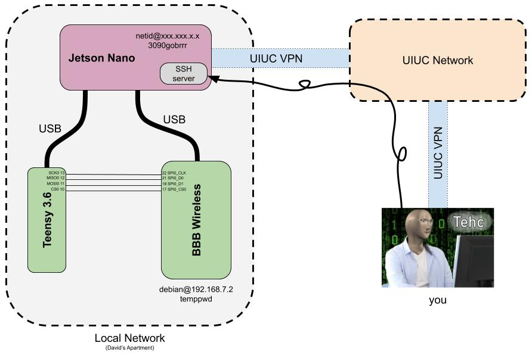

# WFH_Instructions


> We're living the future so the present is our past. \
> -Kanye West

## Schematicc



## Instrucc

### 1. Creating a user in the Jetson Nano

- Add your netid to the Work-from-home User Log [here](https://docs.google.com/spreadsheets/d/11z0fmfBTa--hZfY2xWrfAP6I5SCtMLZB3iU9dNHtwfE/edit?usp=sharing) and contact me (Ayberk, prefereably via Slack) so I can create a user for you.
 - This is how we'll make sure multiple people aren't using the system at the same time (could get confusing)
- Connect to the UIUC VPN using the [Cisco AnyConnect VPN client](https://techservices.illinois.edu/services/virtual-private-networking-vpn/download-and-set-up-the-vpn-client). Follow the instructions for your particular OS.
 - Once you're "in" the UIUC network, the Jetson Nano should be accessible to you as if it were on your home network.
- Find the Jetson Nano's IP on the [User Log](https://docs.google.com/spreadsheets/d/11z0fmfBTa--hZfY2xWrfAP6I5SCtMLZB3iU9dNHtwfE/edit?usp=sharing).
 - This IP will likely be different every time the Nano connects to the UIUC network, so try not to crash it, as that would require a reboot.
 - hmu if it doesn't work and I'll update it if I can.
- Connect using the following:
 ```
ssh netid@xxx.xxx.xx.x
 ```

### 2. Connecting to the BeagleBone Black

- The BBB is on an ethernet connection, and the IP never changes, you can SSH into it *thorugh* the Nano with `ssh debain@192.168.7.2` with password `temppwd`.
 - This should never change

### 3. Compiling and uploading to Teensy

- You will need to install `PlatformIO Core` for you own user on the Jetson Nano.
 - Run the following:
```
python3 -c "$(curl -fsSL https://raw.githubusercontent.com/platformio/platformio/develop/scripts/get-platformio.py)"
```
- Edit your .bashrc with Nano (or Vim, if you dare) with `nano ~/.bashrc` and add the following line to the very end:
```
export PATH=$PATH:~/.platformio/penv/bin
```
- Source you .bashrc file with `source ~/.bashrc`
- Run `platformio` or `pio` for short to verify that the installation was successful.

Documentation on the PlatformIO Core found [here](https://docs.platformio.org/en/latest/core/index.html)
